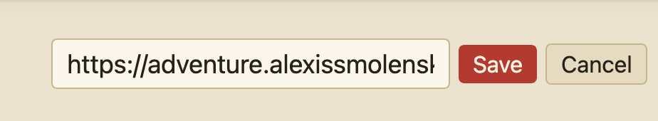
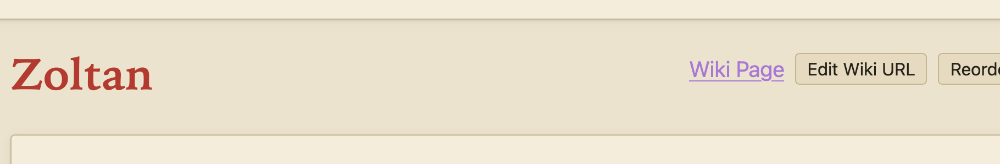
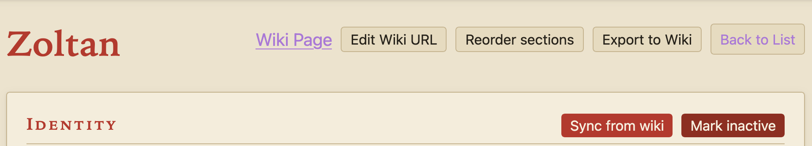
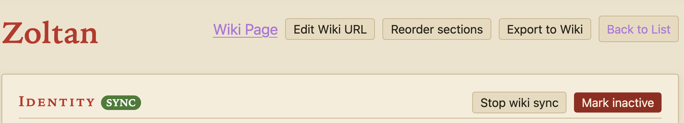

# External Synchronization

External synchronization, AKA external sync, is a feature that allows you to maintain character information on a non-Zingor webpage and have it synchronized into Zingor. This is accomplished by adding some Zingor-specific HTML markup to the external webpage. While external sync is active, character sheet details are synchronized into Zingor approximately once per minute.

External sync starts off inactive for all characters. To make use of external sync, follow the instructions on this page.

## Associating Your Character with an External Webpage

In Zingor, visit the character sheet of the character with which you want to use external sync.

At the top-right of the character sheet, find the button "Add Wiki URL".


:::{note}
The feature currently refers to the external webpage as a "wiki page" or "wiki URL", but it can be any webpage, as long as you're able to add basic HTML content to that page.
:::

Click that button, and enter the URL of the external page you want to use.



:::{warning}
Fragments (the optional final URL component starting with `#`) are not supported in external page URLs. If a fragment is present in the URL, it will be stripped on save.
:::

After you've added the URL, click Save. You should see the Add Wiki URL button has changed to read Edit Wiki URL, and that a link with the text "Wiki Link" has appeared to the left of that button. This link takes you to the URL you entered.



## Activating External Sync

After saving the URL, you'll also see a new Sync From Wiki button appear in the Identity section.



Click this button to activate external synchronization. You will see a "sync" badge appear (next to the "Identity" heading) to remind you that synchronization is active.



The button that previously said "Sync from wiki" will now say "Stop wiki sync". If desired, click that button to deactivate synchronization.

## Marking Up Your External Webpage

Zingor finds your character's data on the external page by looking for **Zingor microformats** (ZMF): ordinary HTML elements tagged with special `class` names starting with `zingor-`. You keep full control over how the page looks — Zingor only cares about the class names and reads each tagged element's visible text as the value.

:::{note}
ZMF uses `class` attributes (rather than, say, `data-*` attributes) because wiki software such as MediaWiki strips most HTML attributes when saving a page, but preserves `class`.
:::

Each external page describes exactly one character. The markup comes in two shapes: **single fields** and **repeating records**.

### Single Fields

Tag any element with one of the class names below, and its text becomes that field's value:

```html
<td class="zingor-strength">14</td>
<span class="zingor-name">Aldric the Bold</span>
```

| Class | Character field |
|---|---|
| `zingor-name` | Name |
| `zingor-race` | Race |
| `zingor-sex` | Sex |
| `zingor-class` | Class |
| `zingor-level` | Level |
| `zingor-xp` | Experience points |
| `zingor-strength` | Strength |
| `zingor-percentile-strength` | Percentile strength |
| `zingor-dexterity` | Dexterity |
| `zingor-constitution` | Constitution |
| `zingor-intelligence` | Intelligence |
| `zingor-wisdom` | Wisdom |
| `zingor-charisma` | Charisma |
| `zingor-current-hp` | Current hit points |
| `zingor-notes` | Notes |
| `zingor-background` | Background |
| `zingor-appearance` | Appearance |
| `zingor-chosen-field` | Chosen sage field |
| `zingor-chosen-study` | Chosen sage study |

Any field you leave out is simply not synchronized — Zingor keeps whatever value it already has. If the same class appears more than once on the page, the first occurrence wins.

### Money

Coins get their own classes: `zingor-gp`, `zingor-sp`, and `zingor-cp`. These don't set a character field; instead, the counts become gold, silver, and copper coin items in your inventory.

```html
Purse: <span class="zingor-gp">102</span> gold, <span class="zingor-sp">14</span> silver
```

### Repeating Records: Spells and Sage Studies

Lists of things use one level of nesting: a *root* element tagged with the record's class, containing elements tagged with the record's subfield classes. A table row per record is the natural fit, but any container element works.

**Spells** use root class `zingor-spell` with subfields `-name` (required), `-level` (required), and `-memorized` (optional):

```html
<tr class="zingor-spell">
  <td class="zingor-spell-name">Cure Light Wounds</td>
  <td class="zingor-spell-level">1</td>
  <td class="zingor-spell-memorized">X</td>
</tr>
```

**Sage studies** use root class `zingor-sage-study` with subfields `-name` (required) and `-points` (required):

```html
<tr class="zingor-sage-study">
  <td class="zingor-sage-study-name">Faith</td>
  <td class="zingor-sage-study-points">27</td>
</tr>
```

:::{warning}
For spells and sage studies, the page is authoritative *when the markup is present*. If your page contains any `zingor-spell` elements, the spells found there replace your character's spell list in Zingor on each sync. If the page contains no spell markup at all, your Zingor spell list is left alone. The same rule applies to sage studies.
:::

### How Values Are Read

Zingor is forgiving about formatting, so your page can stay human-readable:

- **Text fields** use the element's visible text, with surrounding whitespace trimmed. Formatting markup inside the element (bold, links, etc.) is fine — only the text is kept.
- **Number fields** pick out the first number in the text, ignoring thousands separators — `<td class="zingor-xp">12,450 xp</td>` reads as 12450.
- **Yes/no fields** like `zingor-spell-memorized` treat `X`, `✓`, `yes`, `y`, `true`, or `1` (in any letter case) as yes; anything else — including leaving the cell empty — as no.

When a value can't be understood (say, a level cell containing no number), Zingor never guesses: that field is skipped — or for spells and sage studies, that whole record is skipped — and the rest of the page still syncs.
