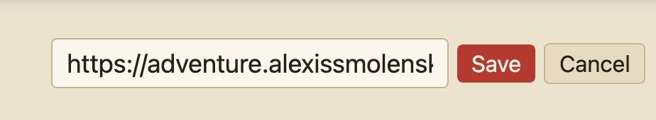
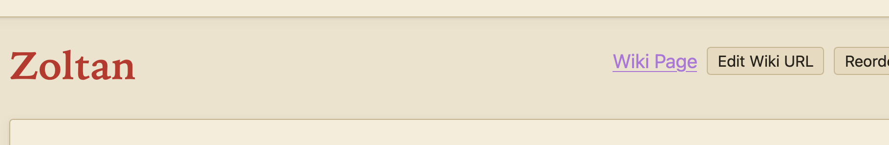
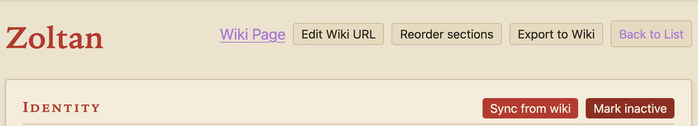
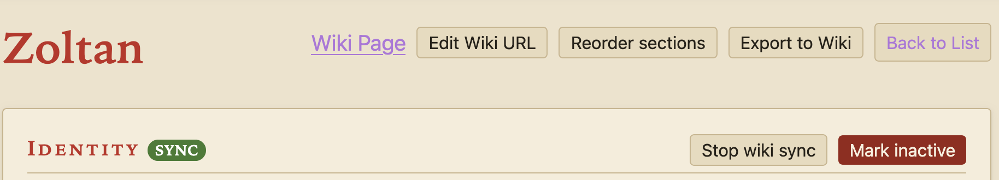

# External Synchronization

External synchronization, AKA external sync, is a feature that allows you to maintain character information on a non-Zingor webpage and have it synchronized into Zingor. This is accomplished by adding some Zingor-specific HTML markup to the external webpage. While external sync is active, character sheet details are synchronized into Zingor approximately once per minute.

External sync starts off inactive for all characters. To make use of external sync, follow the instructions on this page.

## Associating Your Character with an External Webpage

In Zingor, visit the character sheet of the character with which you want to use external sync.

At the top-right of the character sheet, find the button "Add Wiki URL".


:::{note}
The feature currently refers to the external webpage as a "wiki page" or "wiki URL", but it can be any webpage, as long as you're able to add basic HTML content to that page.
:::

Click that button, and enter the URL of the external page you want to use.



:::{warning}
Fragments (the optional final URL component starting with `#`) are not supported in external page URLs. If a fragment is present in the URL, it will be stripped on save.
:::

After you've added the URL, click Save. You should see the Add Wiki URL button has changed to read Edit Wiki URL, and that a link with the text "Wiki Link" has appeared to the left of that button. This link takes you to the URL you entered.



## Activating External Sync

After saving the URL, you'll also see a new Sync From Wiki button appear in the Identity section.



Click this button to activate external synchronization. You will see a "sync" badge appear (next to the "Identity" heading) to remind you that synchronization is active.



The button that previously said "Sync from wiki" will now say "Stop wiki sync". If desired, click that button to deactivate synchronization.

## Marking Up Your External Webpage

Zingor finds your character's data on the external page by looking for **Zingor microformats** (ZMF): ordinary HTML elements tagged with special `class` names starting with `zingor-`. You keep full control over how the page looks: Zingor only cares about the class names and reads each tagged element's visible text as the value.

:::{note}
ZMF uses `class` attributes (rather than, say, `data-*` attributes) because wiki software such as MediaWiki strips most HTML attributes when saving a page, but preserves `class`.
:::

Each external page describes exactly one character. The markup comes in two shapes: **single fields** and **repeating records**.

### Single Records

Tag any element with one of the class names below, and its text will become that field's value:

```html
<td class="zingor-strength">14</td>
<span class="zingor-name">Aldric the Bold</span>
```

| Class | Character field |
|---|---|
| `zingor-name` | Name |
| `zingor-race` | Race |
| `zingor-sex` | Sex |
| `zingor-class` | Class |
| `zingor-level` | Level |
| `zingor-xp` | Experience points |
| `zingor-strength` | Strength |
| `zingor-percentile-strength` | Percentile strength |
| `zingor-dexterity` | Dexterity |
| `zingor-constitution` | Constitution |
| `zingor-intelligence` | Intelligence |
| `zingor-wisdom` | Wisdom |
| `zingor-charisma` | Charisma |
| `zingor-current-hp` | Current hit points |
| `zingor-armor-class` | Armor class (AC) |
| `zingor-notes` | Notes |
| `zingor-background` | Background |
| `zingor-appearance` | Appearance |

Anything you leave out is simply not synchronized: Zingor keeps whatever value it already has. If the same markup appears more than once on the page, the first occurrence wins.

:::{note}
Money and inventory are not synchronized. Coins are inventory items in Zingor, and inventory (which containers hold what, how stacks are split) is managed in Zingor itself.
:::

### Repeating Records: Spells and Sage Knowledge

Lists of things use one level of nesting: a *root* element tagged with the record's class, containing elements tagged with the record's subfield classes. A table row per record is the natural fit, but any container element works.

Records never nest inside other records, so your page can stay a set of ordinary tables. Where one record belongs to another, it names it instead — as sage concentrations name their study.

**Spells** use root class `zingor-spell` with subfields `-name` (required), `-level` (required), and `-memorized` (optional):

```html
<tr class="zingor-spell">
  <td class="zingor-spell-name">Cure Light Wounds</td>
  <td class="zingor-spell-level">1</td>
  <td class="zingor-spell-memorized">X</td>
</tr>
```

:::{warning}
The `zingor-spell-memorized` field, if it evaluates as "yes", means that the spell *is currently memorized*, not that it has been cast/is not memorized.
:::

**Chosen fields** are those in which your character has specialized. Possessing a field and having *chosen* it are two different things. For chosen fields, use root class `zingor-chosen-field`, with the single subfield `-name` (required):

```html
<li class="zingor-chosen-field">
  <span class="zingor-chosen-field-name">Animal Training</span>
</li>
```

Zingor calculates which fields appear on your character sheet as your class's fields, plus the fields of any out-of-class studies you possess. That's why there's no ZMF record for merely possessing a field: list the studies you possess, and the fields follow.

:::{note}
When [exporting to a wiki page](wiki-export.md), the `=== Field ===` headings over the study tables are *every* field you have, while the "Chosen Fields" list above them is the smaller set you picked.
:::

**Sage studies** use root class `zingor-sage-study` with subfields `-name` (required), `-points` (required), and `-chosen` (optional):

```html
<tr class="zingor-sage-study">
  <td class="zingor-sage-study-name">Faith</td>
  <td class="zingor-sage-study-points">27</td>
  <td class="zingor-sage-study-chosen">X</td>
</tr>
```

`zingor-sage-study-chosen`, if it evaluates as "yes", marks the study as one you've *chosen*, as opposed to one you just have points in. This is the same distinction as for fields, except that a study you hold is a record in its own right rather than something Zingor derives.

:::{warning}
A study can be listed under more than one field heading on your page (e.g. Beasts belongs to both Reverence and Legends & Folklore). As mentioned under [Single Records](#single-records), if Zingor encounters the same markup twice while importing, **the first occurrence wins**. This applies to studies too, and to concentrations: listing the same subject twice under one study keeps the first and warns about the second.
:::

### Concentrations

A few studies don't hold their points as a single pool. Their points are committed to named subjects — a period and sphere of History, one of the Outer Planes, a locus of Geography — and knowledge aimed at one does nothing for any other. Thirty points of History never makes you an authority on history as such, only on some particular slice of it.

Concentrations are records of their own, `zingor-sage-concentration`, with subfields `-study` (required), `-name` (required), and `-points` (optional). They sit alongside your study records rather than inside them, so each one names the study it belongs to:

```html
<tr class="zingor-sage-study">
  <td class="zingor-sage-study-name">History</td>
  <td class="zingor-sage-study-points">37</td>
</tr>

<tr class="zingor-sage-concentration">
  <td class="zingor-sage-concentration-study">History</td>
  <td class="zingor-sage-concentration-name">Ancient Asia</td>
  <td class="zingor-sage-concentration-points">22</td>
</tr>
<tr class="zingor-sage-concentration">
  <td class="zingor-sage-concentration-study">History</td>
  <td class="zingor-sage-concentration-name">Medieval Asia</td>
  <td class="zingor-sage-concentration-points">15</td>
</tr>
```

The study record still carries your overall total, and it may exceed the sum of your concentrations: the difference is points you hold but haven't committed anywhere yet, which your sheet shows as an "unallocated" line. If you list concentrations for a study you never list on its own, Zingor works the total out from them and says so in a warning.

Some studies have a fixed set of concentrations and some don't, and Zingor treats the two differently:

- **History, the Outer Planes, and Heraldry** have complete lists — History's twelve period-and-sphere pairs, Heraldry's four mega-cultures, and the outer planes themselves. Zingor will correct your spelling of any of them, but a name that isn't on the list is ignored with a warning, because it isn't an allocation the rules allow. On your sheet these appear as a dropdown rather than a text box.
- **Geography, Beasts, Artifacts, Law & Policy, and Politics** are open. A locus, a studied beast, or a political entity is your DM's invention or a list too long and too changeable for Zingor to hold, so whatever you type is kept verbatim.

#### When to leave the points out

For some studies a concentration has no number of its own, and you can leave the `-points` cell empty:

- **Beasts and Artifacts** grant you one studied subject per ten points, so every subject is worth the same ten. Writing a different number gets you a warning and the rule is applied anyway.
- **Law & Policy and Politics** don't divide their points at all — each of their concentrations is worth the study's *whole* total. A character with 22 points in Politics is a 22-point authority on their chosen entity (and, per the study, counts at half that everywhere else, which your sheet works out for you).

:::{warning}
Naming a concentration under a study that doesn't have any (Faith, say) is ignored, with a warning on your sheet. So is naming one under Athletics — see below.
:::

**Sage abilities** (also "standalone sage abilities") are one-off sage abilities gained other than through the sage study system, such as through a character's [progenitor](https://wiki.alexissmolensk.com/index.php/Progenitor). They use root class `zingor-sage-ability` with subfields `-name` (required), `-points` (required), `-source` (optional freetext noting where the ability came from), and `-from-study` (optional):

```html
<tr class="zingor-sage-ability">
  <td class="zingor-sage-ability-name">Read Weather</td>
  <td class="zingor-sage-ability-points">12</td>
  <td class="zingor-sage-ability-source">Old sailor's mentorship</td>
</tr>
```

`zingor-sage-ability-from-study` handles the studies whose concentrations *are* sage abilities in their own right. Athletics is the one Zingor knows: the wiki counts each of its disciplines a sage ability outright, so there is no reason for Zingor to invent a second kind of record for them. Name the study the ability comes from, and it is listed both under that study on your sheet and among your standalone abilities:

```html
<tr class="zingor-sage-ability">
  <td class="zingor-sage-ability-name">Swimming</td>
  <td class="zingor-sage-ability-points">14</td>
  <td class="zingor-sage-ability-from-study">Athletics</td>
</tr>
```

:::{warning}
For spells, chosen fields, sage studies, sage concentrations, and sage abilities, the page is authoritative *when the markup is present*. For example, if your page contains any `zingor-spell` elements, the spells found there replace your character's spell list in Zingor on each sync. If the page contains no spell markup at all, your Zingor spell list is left alone.

Each of those is a section in its own right, concentrations included. A page with a study table but no concentration table is saying nothing about your concentrations, so Zingor keeps the ones you have. Once your page *does* list concentrations, though, that table is the whole truth: one you delete from it is deleted on your sheet.
:::

### How Values Are Read

Zingor is forgiving about formatting, so your page can stay human-readable:

- **Text fields** use the element's visible text, with surrounding whitespace trimmed. Formatting markup inside the element (bold, links, etc.) is fine; only the text is kept.
- **Number fields** pick out the first number in the text, ignoring thousands separators: `<td class="zingor-xp">12,450 xp</td>` reads as 12450.
- **Yes/no fields** like `zingor-spell-memorized` treat `X`, `✓`, `yes`, `y`, `true`, or `1` (in any letter case) as "yes"; anything else (including leaving the cell empty) as "no".

When a value can't be understood (say, a level cell containing no number), Zingor never guesses: the rest of the page still syncs, but that field is skipped (or, for spells and sage studies, that whole record is skipped).

## Seeing What Didn't Sync

Every skipped value is reported back on the character sheet, so a typo in your markup doesn't quietly go unnoticed.

While external sync is active, the Identity section carries a line reading, for example, "2 things on the external page couldn't be read", along with how long ago that sync ran. Click it to expand the list, which names each field or record that was skipped and why.

The line appears only when the most recent sync had something to report. Fix the markup on your page, and the line disappears on the next sync — there's nothing to dismiss.

:::{note}
At most {{ max_sync_warnings }} warnings are listed. If a sync produces more than that, the list ends by telling you how many further warnings there were.
:::

Turning off external sync clears the list, since it describes a page Zingor is no longer reading.
